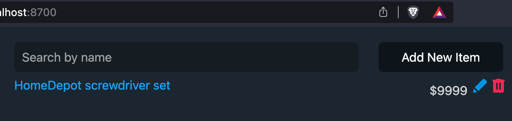

# PriceWatch
A way to monitor an item on a website and get notified of the price changes

Add modules to `/readers` directory that can extract the price from a site. See `demo_store.py` as an example.

> [!CAUTION]
> **NB:** FOR PERSONAL USE ONLY! THIS IS NOT SECURE FOR A PRODUCTION SYSTEM!

## Running

1. Create a `docker-compose.yaml` file:

    ```yaml
    services:
      pricewatch:
        image: builder555/pricewatch:latest
        container_name: pricewatch
        env_file:
          - .env
        volumes:
          - ./items.json:/app/app/db/items.json
        ports:
          - 8700:8700
    ```

2. Save [items-example.json](./items-example.json) as `items.json` file in the same directory.

3. Put tokens in `.env` file.

    e.g. for telegram notifier:

    ```.env
    TELEGRAM_TOKEN=2223545336:AAAAAAAAAABBBBBBBBBCCCCCCCCCDDDDDDDD
    TELEGRAM_CHAT_ID=555555555
    ```

4. Run it using docker compose:

    ```bash
    docker compose up -d
    ```

5. Navigate to [http://localhost:8700](http://localhost:8700) to add/remove items to monitor.

You should see a page that looks like this:



As long as the container is running, it will check for price changes every 4 hours and send a telegram notification (assuming you have the proper token and chat id).

## Development

```bash
git clone https://github.com/builder555/pricewatch.git
cd pricewatch
```

### Docker

Use `compose-dev.yml`:

```bash
docker compose -f compose-dev.yml up -d --build
```

Open [http://localhost:8700/](http://localhost:8700/) (assuming you didn't override the port) to view the UI.

### Stand-alone

#### Prerequisites

* python 3.10+
* pipenv

#### Install

```bash
PIPENV_VENV_IN_PROJECT=true pipenv install
cp items-example.json app/db/items.json
```

#### Set up notifier

* For telegram notifier place tokens in `.env` file in the `pricewatch` folder (see above).
* For demo notifier, modify `notify` function in `main.py` to use `demo_notifier` instead of `telegram_notifier`.

#### Run - price monitor

```bash
$ PIPENV_VENV_IN_PROJECT=true pipenv shell 
$ python main.py 
```

You should see similar output (if using demo notifier):

```
[2023-10-22 08:04:21.745922] Checking HomeDepot screwdriver set...$29.97
Price has changed!
Demo notifier: 
Price has changed for HomeDepot screwdriver set from $9999 to $29.97. Check it out: https://www.homedepot.com/p/Husky-Screwdriver-Set-15-Piece-246340150/204663546

Send to test@example.com
-----
```

> [!IMPORTANT]
> The URL in `items-example.json` may not work anymore, delete it and replace with a different one.

#### Run - UI
To use the UI, run the following:

```bash
pipenv shell
python -m app.ui.server
```

#### Run automatically
You can set up a cronjob to run periodically

Assumptions:
* the full path to the directory is `/home/me/pricewatch`
* `pipenv` is in `/usr/bin/pipenv` 

```
0 */4 * * * cd /home/me/pricewatch && /usr/bin/pipenv run start >>log.txt 2>>error.txt
```
